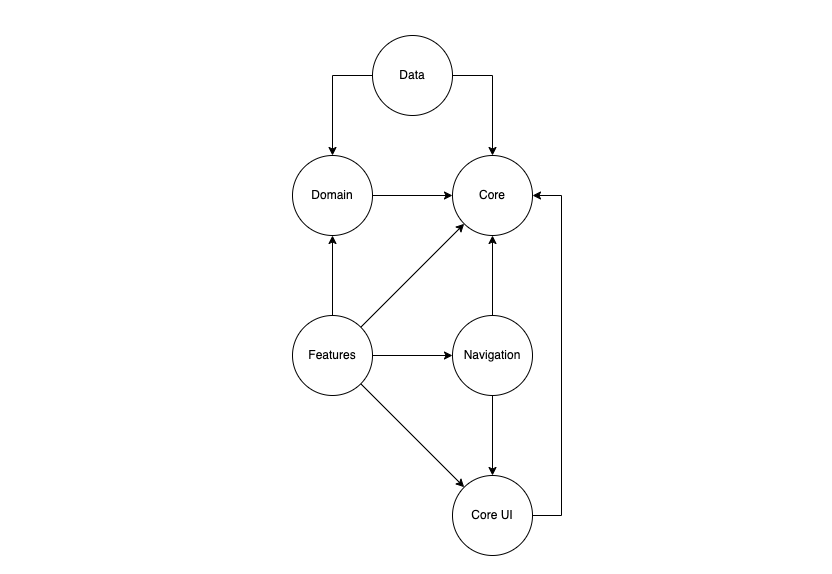

# DevPilot
#### _Command-line interface (CLI) for generating a Flutter project_


It prompts the user for input and then creates a Flutter project with the given specifications. The generated project will include a set of predefined modules, such as
- Core
- Core UI
- Data
- Domain
- Navigation

The user can also specify additional
- Features
- Flavors
- Packages

The code uses the [dcli](https://pub.dev/packages/dcli) and [mason_logger](https://pub.dev/packages/mason_logger) packages for input/output handling and logging, respectively. It also relies on several custom classes (**AppConstants**, **DirectoryService**, **FileService**, **Input**, **ScriptService**, and **Validator**) for various tasks.

## Getting Started

Activate globally via:
```sh
dart pub global activate dev_pilot
```

To create project

```sh
dev_pilot create
```
Pub installs executables into $HOME/.pub-cache/bin
If the one not in your path please add this command to your shell's config file (.bashrc, .bash_profile, etc.)

```sh
export PATH="$PATH":"$HOME/.pub-cache/bin"
```

## Generated Project Structure

The created project will consist of the following modules:
- Core
- Domain
- Data
- Core UI
- Navigation
- Features (optional)

##### Core
Core module serves as a common dependency for all other project modules and has two main functions:
1. Contains elements common to the application (configuration, DI mechanism, application-level constants, localization keys, etc.), various extensions, and utilities.
2. Exports common or frequently used dependencies (e.g., `flutter_bloc` or `get_it`), eliminating the need to import them in each dependent module.
```
core/
├── lib/
│   ├── config/
│   │   └── network
│   ├── constants
│   ├── di
│   ├── localization
│   ├── logger
│   └── utils
└── resources/
    └── lang
```

##### Core UI
Core UI defines common user interface elements for the entire application and includes:
- Application theme. This encompasses the colors and fonts used in the application, standard dimensions (such as default page padding or default animation duration), and images, icons, and animations
- Set of reusable widgets aligned with the application’s design, such as styled buttons or text fields
```
core_ui/
├── lib/
│   ├── theme
│   └── widgets
└── resources/
    ├── fonts
    ├── images
    └── icons
```

##### Data
Data module implements the interfaces defined in the domain module. It handles data operations and interacts with external APIs. In this case, it consists of the following categories of elements:
- Repository implementations
- Data providers, designed to interact with data sources and operate with entities
- Entities, dedicated models for data sources
- Mappers, converting domain models to entities and vice versa
- DI setup for the data layer
```
data/
└── lib/
    ├── di
    ├── entities
    ├── errors
    ├── mappers
    ├── providers
    └── repositories
```

##### Domain
Domain module describes the application's subject area, defining domain models and possible use cases. It also establishes the necessary interfaces for external dependencies, particularly for the data layer. In this case, the domain module includes the following categories of elements:
- Domain models
- Use-cases (atomic domain operations)
- Repository interfaces
- Domain exceptions
- DI setup for the domain layer
```
domain/
└── lib/
    ├── di
    ├── exceptions
    ├── models
    ├── repositories
    └── use_cases
```

##### Features
Features refers to a group of modules with a similar structure. Each of these modules implements a specific feature of the application (e.g., user login or order history). They relate to the presentation layer and perform operations in the domain by invoking the corresponding use cases.

##### Navigation
Navigation module contains the application router configuration and provides the necessary DI for navigation.
```
navigation/
└── lib/
    ├── app_router
    └── di
```

##### Dependency Graph
Below is the dependency graph of the described modules:


## Plugins

Dillinger is currently extended with the following plugins.
Instructions on how to use them in your own application are linked below.

| Plugin | README |
| ------ | ------ |
| dcli | https://pub.dev/packages/dcli |
| mason_logger | https://pub.dev/packages/mason_logger |
| args | https://pub.dev/packages/args |


## Demo

A demo gif instructions for correct use  `dev_pilot`

